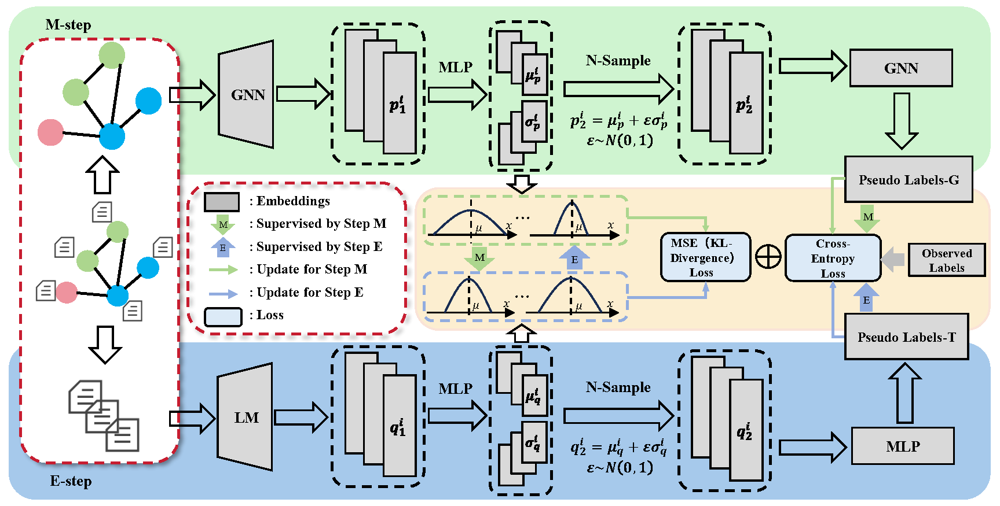

## Hybrid Variational Inference for Text-Attributed Graphs through Joint Label-Embedding Estimation
**Official implementation of paper**   [Hybrid Variational Inference for Text-Attributed Graphs through Joint Label-Embedding Estimation]  

Yizhuo Ma, Rongzheng Wang, ShuangLiang, KeQin*

**Submission in ICML 2025**

## Overview

we propose HVEM, a Hybrid Variational Expectation-Maximization framework through joint label-embedding estimation for TAGs. HVEM is designed as a dual-branch framework, with each branch comprising two components that focus on estimating embeddings and labels, respectively.

## Requirements

The core packages are as below:

* numpy==2.1.1
* networkx==3.3
* scikit-learn==1.5.2
* scipy==1.14.1
* tokenizers==0.20.0
* torch==2.4.1+cu121
* torch-geometric==2.6.1
* transformers==4.45.1
* tqdm==4.66.5

## Datasets

For `wikics, photo, citeseer` datasets, you can download them from [dataset](https://drive.google.com/drive/folders/1bSRCZxt0c11A3717DYDjO112fo_zC8Ec?usp=sharing) and put them in `TAG_data/dataset_name/`.
Other datasets can be obtained in [https://github.com/XiaoxinHe/TAPE](https://github.com/XiaoxinHe/TAPE). Each dataset is saved as `.pt` file.

## Pretrained Language Models
We use BERT-large, RoBERTa-large, DeBERTa-base as our lm-backbone. You can download these models from huggingface:

* [BERT-large](https://huggingface.co/google-bert/bert-large-uncased)
* [RoBERTa-large](https://huggingface.co/FacebookAI/roberta-large)
* [DeBERTa-base](https://huggingface.co/microsoft/deberta-base)

## Running Commands

### 1. lm_ft.py
Use `run_lm.sh` to run the codes in `./src/LM/lm_ft.py` and fine-tuning the LM.

### 2. main.py
Use `run.sh` to run the codes in `main.py` and reproduce the published results. Please refer to the content listed in the appendix of our paper for parameter adjustments for different datasets.

